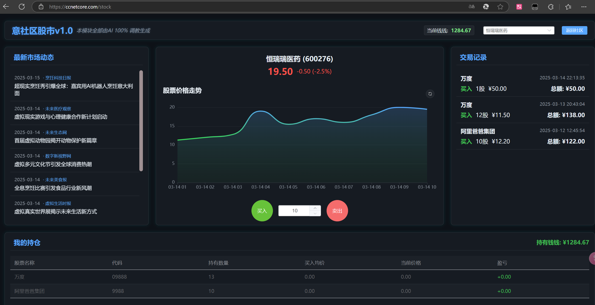

# 🚀 一个由Semantic Kernel AI驱动的股市项目

## 📋 简介

这是一个完全由AI驱动的模拟股市游戏系统，基于.NET 8和Vue3开发（前后端100%代码由开发，应该叫做基于ai开发）。项目利用Semantic Kernel和大型语言模型生成股票价格走势和新闻内容，模拟真实市场环境中股票价格受新闻影响的机制。用户可以在平台上购买、出售股票，体验虚拟投资的乐趣。

本项目只是Yi框架的一个小模块，展示了如何将AI技术与Web应用无缝集成，创造有趣且动态的用户体验。

你可以直接在Yi框架中查看全部模块：

YI框架地址：[点击跳转](https://gitee.com/ccnetcore/Yi)

意社区股市在线体验地址：
[https://ccnetcore.com/stock](https://ccnetcore.com/stock)

界面：

## ✨ 特点

- 🤖 **完全AI驱动**：股票价格走势、市场新闻全部由AI动态生成
- 📰 **新闻影响机制**：AI生成的新闻会影响相关行业的股票价格走势
- 💹 **实时交易系统**：用户可以随时买入卖出股票
- 🔮 **动态价格预测**：基于历史数据和新闻事件，AI预测未来24小时股价走势
- ⏱️ **定时更新机制**：系统定期生成新闻和更新股价，保持市场活跃
- 📊 **可视化数据展示**：直观的价格图表和市场信息展示
- 🎯 **高度定制化提示词**：精心设计的AI提示词，确保生成内容的质量和相关性

## 🚀 启动方式

- 🔄 **后端(Yi.Abp.Net8)**
- 🖥️ **前端(Yi.Bbs.Vue3)**

## 🏗️ 项目结构

### 🧠 后端核心模块

- 📰 **NewsManager**：管理新闻内容生成与存储
- 📈 **StockMarketManager**：处理股票交易和价格生成
- 🤖 **SemanticKernelClient**：封装与AI模型的交互
- 🔌 **StockPlugins/NewsPlugins**：自定义Semantic Kernel插件

### ⏰ 定时任务

- 📰 **GenerateNewsJob**：定时生成新闻内容(每小时触发，概率生成)
- 📊 **GenerateStockPricesJob**：定时生成股票价格(每天凌晨执行)

### 🖥️ 前端组件

- 📊 **股票仪表盘**：显示股票价格、交易量等信息
- 💰 **交易面板**：用于买入/卖出股票
- 📰 **新闻流**：显示最新的市场新闻
- 📈 **价格图表**：可视化展示股票价格走势

## 🔮 总结

🌟 AI驱动股市游戏是Yi框架生态中展示AI潜力的一个创新项目。通过结合大型语言模型和Web应用，我们创造了一个动态且有趣的虚拟股市环境。这个项目不仅展示了AI在内容生成方面的能力，也为用户提供了一个学习投资概念的互动平台。

🚀 未来，我们计划增加更多功能，如多样化的市场事件、更复杂的价格预测算法和个性化的投资建议系统。

💫 我们拥抱AI，不仅因为它现在的能力，更因为它未来无限的可能性。AI的迭代速度令人惊叹，我们相信这只是开始。

---

✨ 你看到的全部，都是由AI生成，甚至是这个readme文件，甚至，是你现在看到的这句话，是的，就是这句话也是AI说的~ ✨
